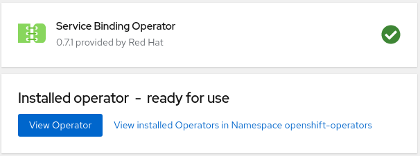
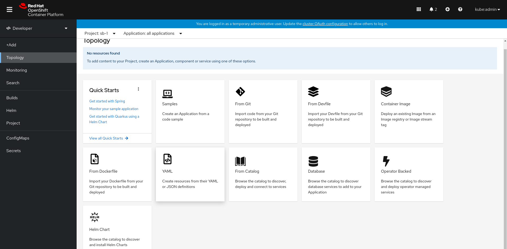
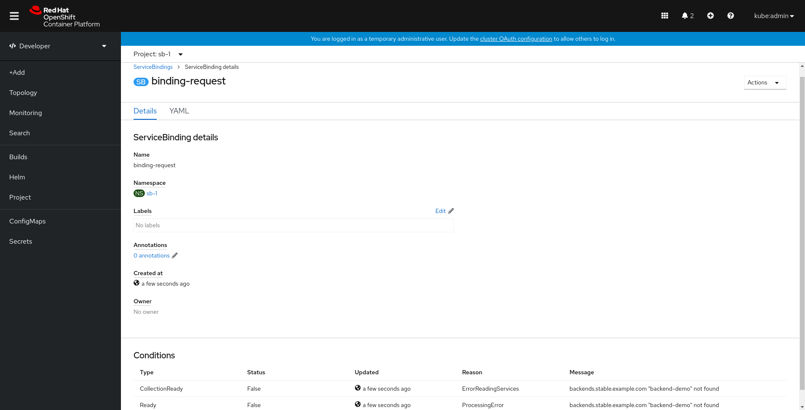

# Installing Service Binding

## Compatiblity Note

### Platforms

The Service Binding Operator is compatible with:
- Kubernetes >= v1.7.0
- Openshift >= 4.5 

### Pre-requisites

- OLM : Follow the [installation guide](https://github.com/operator-framework/operator-lifecycle-manager/blob/master/doc/install/install.md) to install OLM, a tool to help manage operators running on the cluster.

## Install on Kubernetes

2. Install Service Binding Operator

```console
$ kubectl apply -f https://github.com/redhat-developer/service-binding-operator/releases/download/v0.7.1/release.yaml
namespace/service-binding-operator created
configmap/service-binding-operator-manager-config created
clusterrole.rbac.authorization.k8s.io/service-binding-operator created
deployment.apps/service-binding-operator created
clusterrole.rbac.authorization.k8s.io/service-binding-operator-servicebinding-viewer-role created
customresourcedefinition.apiextensions.k8s.io/servicebindings.binding.operators.coreos.com created
clusterrole.rbac.authorization.k8s.io/service-binding-operator-servicebinding-editor-role created
clusterrolebinding.rbac.authorization.k8s.io/service-binding-operator created
serviceaccount/service-binding-operator created
```

The operator will be installed in the "operators" namespace and will be usable from all other namespaces in the cluster.

3. Check if operator has been installed successfully:

```console
$ k get csv -n operators
NAME                              DISPLAY                    VERSION   REPLACES   PHASE
service-binding-operator.v0.4.0   Service Binding Operator   0.4.0                Succeeded
```

4. To verify the installation, create a Service Binding:

```yaml
apiVersion: operators.coreos.com/v1alpha1
kind: ServiceBinding
metadata:
        name: binding-request
spec:
        services:
                -   group: stable.example.com
                    version: v1
                    kind: Backend
                    name: backend-demo
```

The output should be:

```yaml
apiVersion: operators.coreos.com/v1alpha1
kind: ServiceBinding
metadata:
  annotations:
    kubectl.kubernetes.io/last-applied-configuration: |
      {"apiVersion":"operators.coreos.com/v1alpha1","kind":"ServiceBinding","metadata":{"annotations":{},"name":"binding-request-backend","namespace":"default"},"spec":{"services":[{"group":"stable.example.com","kind":"Backend","name":"backend-demo","version":"v1"}]}}
  creationTimestamp: "2021-05-17T07:09:48Z"
  generation: 1
  managedFields:
  - apiVersion: operators.coreos.com/v1alpha1
    fieldsType: FieldsV1
    fieldsV1:
      f:metadata:
        f:annotations:
          .: {}
          f:kubectl.kubernetes.io/last-applied-configuration: {}
      f:spec:
        .: {}
        f:services: {}
    manager: kubectl
    operation: Update
    time: "2021-05-17T07:09:48Z"
  - apiVersion: operators.coreos.com/v1alpha1
    fieldsType: FieldsV1
    fieldsV1:
      f:spec:
        f:detectBindingResources: {}
      f:status:
        .: {}
        f:conditions: {}
        f:secret: {}
    manager: service-binding-operator
    operation: Update
    time: "2021-05-17T07:09:48Z"
  name: binding-request-backend
  namespace: default
  resourceVersion: "5795"
  uid: 3c2114c9-311d-43a9-92e1-640179ab673a
spec:
  services:
  - group: stable.example.com
    kind: Backend
    name: backend-demo
    version: v1
status:
  conditions:
  - lastHeartbeatTime: "2021-05-17T09:05:46Z"
    lastTransitionTime: "2021-05-17T07:09:48Z"
    message: the server could not find the requested resource
    reason: ServiceNotFound
    status: "False"
    type: CollectionReady
  - lastHeartbeatTime: "2021-05-17T09:05:46Z"
    lastTransitionTime: "2021-05-17T07:09:48Z"
    status: "False"
    type: InjectionReady
  - lastHeartbeatTime: "2021-05-17T09:05:46Z"
    lastTransitionTime: "2021-05-17T07:09:48Z"
    status: "False"
    type: Ready
  secret: ""

```

## Install on Openshift

1. Navigate to the `Operators` -> `OperatorHub` in the OpenShift console.

2. Select `Developer Tools` category.

3. Select the `Service Binding Operator`:


4. Select `beta` channel.

5. Select `All namespaces on the cluster` installation mode.

6. Select `Automatic` approval strategy.

7. Click on `Install`.



8. To verify the installation, click on the `YAML` option in the `Topology` tab in the Developer perspective.



9. Add the following YAML in the editor:

```yaml
apiVersion: operators.coreos.com/v1alpha1
kind: ServiceBinding
metadata:
        name: binding-request
spec:
        services:
                -   group: stable.example.com
                    version: v1
                    kind: Backend
                    name: backend-demo
```

10. You could see ServiceBinding details and Conditions in the following page



For help report an issue on [Github](https://github.com/redhat-developer/service-binding-operator)

