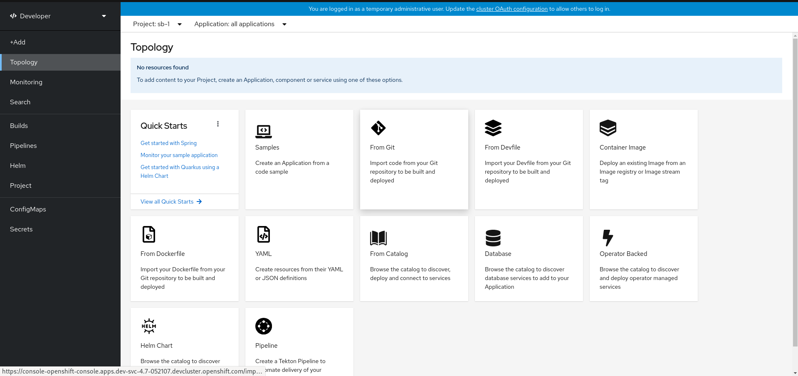
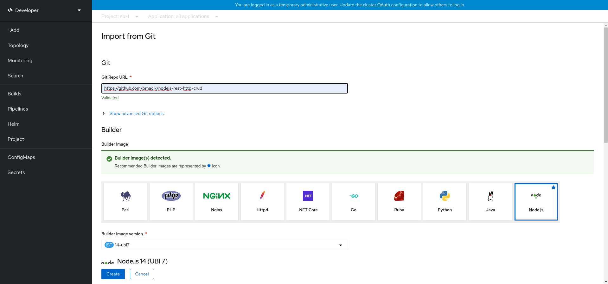
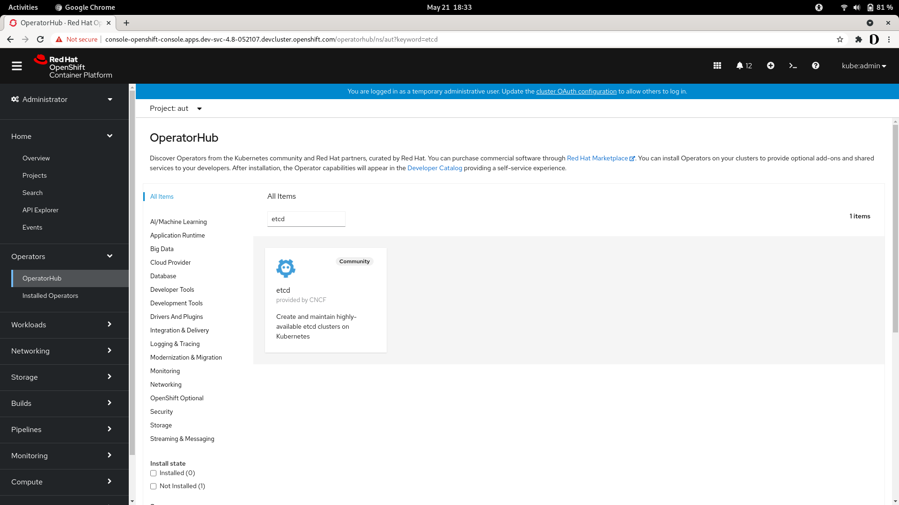

# Quick Start

_Service Binding Operator should be [installed](./installing-service-binding.md) on the cluster prior to running this quick start guide._

In this section we are providing a sample application that one can deploy and just use to play around.

## Kubernetes

### Application

An application is a process running within a container. Examples include a NodeJS Express application, a Ruby Rails application or a Spring Boot application.

Create a NodeJS application:

```yaml
kubectl apply -f - << EOD
---
apiVersion: apps/v1 ############################### GROUP/VERSION
kind: Deployment    ############################### RESOURCE

metadata:
  name: nodejs-app  #################### NAME
  labels:
    app: nodejs
    runtime: nodejs
    runtime-version: 14-ubi7

spec:
  selector:
    matchLabels:
      app: nodejs
  replicas: 1
  template:
    metadata:
      labels:
        app: nodejs
        deploymentconfig: nodejs
    spec:
      containers:
      - name: nodejs
        image: nodejs:latest
        ports:
        - containerPort: 8080
          protocol: TCP
EOD
```

Application can be a podSpec based resource like "Deployment" or "DeploymentConfig" or a non podSepc based resource like a Custom Resource Definition.

### Service

Apply the following CatalogSource:

```yaml
kubectl apply -f - << EOD
---
apiVersion: operators.coreos.com/v1alpha1
kind: CatalogSource
metadata:
    name: sample-db-operators
    namespace: openshift-marketplace
spec:
    sourceType: grpc
    image: quay.io/redhat-developer/sample-db-operators-olm:v1
    displayName: Sample DB Operators
EOD
```

Apply the following Subscription:

```yaml
apiVersion: operators.coreos.com/v1alpha1
kind: Subscription
metadata:
    name: db-operators
    namespace: openshift-operators
spec:
    channel: stable
    installPlanApproval: Automatic
    name: db-operators
    source: sample-db-operators
    sourceNamespace: openshift-marketplace
    startingCSV: postgresql-operator.v0.0.8
```

Create a postgresql database:

```yaml
kubectl apply -f - << EOD
---
apiVersion: postgresql.baiju.dev/v1alpha1 ########### GROUP/VERSION
kind: Database ###################################### RESOURCE
metadata:
  name: db-demo ##################################### NAME
  namespace: service-binding-demo
spec:
  image: docker.io/postgres
  imageName: postgres
  dbName: db-demo
EOD
```

### Service Binding

To connect the `nodejs-app` Deployment with `db-demo` Database,
create a `ServiceBinding` custom resource which includes both Deployment and Database metadata:
- Group 
- Version 
- Resource 
- Name

```yaml
apiVersion: binding.operators.coreos.com/v1alpha1
kind: ServiceBinding

metadata:
  name: binding-request 

spec:

  application:
    group: apps 
    version: v1
    resource: deployments
    name: nodejs-app

  service:
   group: postgresql.baiju.dev
   version: v1alpha1
   resource: Database
   name: db-demo
```

The Service Binding status should be updated:

```yaml
status:
  conditions:
  - lastHeartbeatTime: "2021-05-17T09:05:46Z"
    lastTransitionTime: "2021-05-17T07:09:48Z"
    status: "True"
    type: CollectionReady
  - lastHeartbeatTime: "2021-05-17T09:05:46Z"
    lastTransitionTime: "2021-05-17T07:09:48Z"
    status: "True"
    type: InjectionReady
  - lastHeartbeatTime: "2021-05-17T09:05:46Z"
    lastTransitionTime: "2021-05-17T07:09:48Z"
    status: "True"
    type: Ready
```

## OpenShift

_User should be logged in as a developer._

### Application

1. Login to the Openshift Console as a developer.

2. Under the topology section, click on `From Git`.



3. Fill in the form:

* `Git Repo URL` = `https://github.com/pmacik/nodejs-rest-http-crud`

* `Builder Image` = `Node.js`

* `Name` = `nodejs-rest-http-crud`

* `Application Name` = `nodejs-rest-http-crud`

* `Select the resource type to generate` = `Deployment`

* `Create a route to the application` = `checked`



And click on `Create`.

Your application is created!

### Service

1. Install etcd operator from operatorhub



2. Create service instance by copying the following YAML in the topology section:

```yaml
apiVersion: "etcd.database.coreos.com/v1beta2"
kind: "EtcdCluster"
metadata:
  annotations:
    etcd.database.coreos.com/scope: clusterwide
  name: "etcd-cluster-example"
spec:
  repository: quay.io/coreos/etcd
  size: 3
  version: "3.2.13"
```

### Service Binding

1. Create Service Binding by copying the following YAML in the topology section:

```yaml
apiVersion: binding.operators.coreos.com/v1alpha1
kind: ServiceBinding
metadata:
  name: binding-request
spec:
  application:
    group: apps
    version: v1
    resource: deployments
    name: nodejs-rest-http-crud
  services:
  - group: etcd.database.coreos.com
    version: v1beta2
    kind: EtcdCluster
    name: etcd-cluster-example
  detectBindingResources: true
```

The Service Binding status should be updated:

```yaml
status:
  conditions:
  - lastHeartbeatTime: "2021-05-17T09:05:46Z"
    lastTransitionTime: "2021-05-17T07:09:48Z"
    status: "True"
    type: CollectionReady
  - lastHeartbeatTime: "2021-05-17T09:05:46Z"
    lastTransitionTime: "2021-05-17T07:09:48Z"
    status: "True"
    type: InjectionReady
  - lastHeartbeatTime: "2021-05-17T09:05:46Z"
    lastTransitionTime: "2021-05-17T07:09:48Z"
    status: "True"
    type: Ready
```